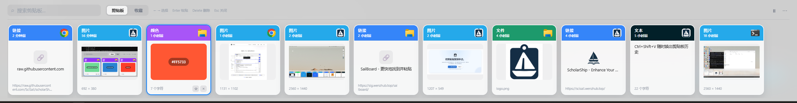

<p align="center">
  <a href="https://github.com/SciSail/sailboard">
    
  </a>
</p>

<h1 align="center">SailBoard</h1>

<p align="center">
  轻盈、iOS 风格的跨平台剪贴板历史工具。
  <br />
  无需注册、无需登录、没有多余的功能。
  <br />
  <a href="https://github.com/SciSail/sailboard"><strong>查看 SailBoard 仓库 »</strong></a>
</p>

---

## 🚀 功能一览

- **全屏宽度毛玻璃面板**：iOS 风格亮色毛玻璃底部横向卡片栏，从屏幕底部滑出，而非悬浮小窗
- **全局快捷键唤出**：默认 `Ctrl+Shift+V`（macOS 上为 `Cmd+Shift+V`，可自定义），窗口自动定位到鼠标所在屏幕底部
- **多种内容类型**：文本、HTTP(S) 链接（自动抓取标题 + favicon）、图片、文件/文件夹、颜色值（`#hex`、`rgb`/`rgba`，预览按实际色值渲染）
- **智能去重**：基于内容 SHA-256 去重，重复项目自动置顶并刷新来源应用与时间，不产生重复历史
- **来源应用识别**：卡片内联展示复制来源应用的图标
- **快速操作**：←/→ 选择、Enter 粘贴当前选中项，鼠标点击先选中、再次点击已选中的卡片才粘贴（避免误触），Delete 删除，两段式 Esc（先清空搜索再关闭）
- **Quick Look 预览（仅 macOS）**：选中卡片后按空格，调用系统原生 Quick Look 面板预览——图片/文件直接预览原文件，文本/链接/颜色值会临时生成一份 `.txt`/`.webloc` 交给系统预览器，链接因此能看到 favicon + 标题而不是纯文本；Windows 上这个按键不做任何事
- **收藏与清理**：支持收藏、按保留天数与最大占用空间自动清理，收藏内容永不过期
- **系统集成**：托盘/菜单栏图标（macOS 上应用不出现在程序坞，纯菜单栏驻留）、选中后自动写回剪贴板并模拟粘贴到之前的前台应用（macOS 上需要在系统设置里授予一次"辅助功能"权限）、开机启动、只允许单实例运行

## 📥 下载使用

Windows 和 macOS（Apple Silicon）已有编译好的安装包，从 [Releases 页面](https://github.com/SciSail/sailboard/releases/latest) 下载即可，无需自行编译：

| 平台 | 下载 |
| --- | --- |
| Windows (x86-64) | [SailBoard_v1.0_Windows_x86.exe](https://github.com/SciSail/sailboard/releases/download/v1.0/SailBoard_v1.0_Windows_x86.exe) |
| macOS (Apple Silicon) | [SailBoard_v1.0_Mac_arm64.dmg](https://github.com/SciSail/sailboard/releases/download/v1.0/SailBoard_v1.0_Mac_arm64.dmg) |

macOS 首次打开需要在"系统设置 > 隐私与安全性"里允许运行（未签名 App 的标准提示），并在弹窗后授予一次"辅助功能"权限（自动粘贴注入需要）。

安装后按下 `Ctrl+Shift+V`（macOS 上 `Cmd+Shift+V`）唤出面板，选中卡片即可粘贴；快捷键可在设置里自定义。

其他平台（Windows x86 以外的架构、macOS Intel、Linux 等）目前没有现成安装包，需要按下方"从源码构建"自行编译。

## 🛠️ 从源码构建

面向开发者，或 Releases 里没有对应平台安装包的情况。

1. **环境要求**：Go 1.23+、Node.js 18+、[Wails v2](https://wails.io/docs/gettingstarted/installation/)
2. **克隆仓库**：`git clone https://github.com/SciSail/sailboard.git`
3. **开发调试**：
   ```powershell
   go test ./...
   cd frontend && npm install && npm run build && cd ..
   wails dev
   ```
   `wails dev` 会启动桌面应用和前端热更新，开发期间复制文本或完整 HTTP(S) 链接即可写入历史。
4. **打包构建**：
   ```powershell
   wails build
   ```
   Windows 构建产物位于 `build/bin/SailBoard.exe`。macOS 上（需先装最新 Xcode Command Line Tools，见下）：
   ```bash
   CGO_LDFLAGS="-framework UniformTypeIdentifiers" wails build -platform darwin/arm64 -clean
   ```
   产物是 `build/bin/SailBoard.app`；打包成带"拖拽安装"背景图提示的 DMG（`create-dmg` 在部分 Homebrew 环境下会装不上，`build/darwin/package-dmg.sh` 用系统自带的 `hdiutil` + AppleScript 自己排版，不依赖它）：
   ```bash
   build/darwin/package-dmg.sh
   ```
   产物默认是 `build/bin/SailBoard-1.0.0-arm64.dmg`（可传第一个参数覆盖输出路径）。背景图 `build/darwin/dmg-background.png` 尺寸特意做成 600×400px，跟 Finder 窗口内容区 1:1 对应（Finder 会把 DMG 背景图缩放去适配窗口，不是按 @2x 资源处理，图片尺寸和脚本里的图标坐标必须匹配，否则文字/图标会错位）。
   `CGO_LDFLAGS` 那行是绕开 Wails v2.10.2 在较旧 Xcode SDK 下漏链接 `UniformTypeIdentifiers` 框架的已知问题；如果 `wails build` 本身就因为 `internal error: package "fmt" without types was imported` 之类的信息报错，是 Wails CLI 自带的 `golang.org/x/tools` 版本跟不上较新 Go 工具链，把 `github.com/wailsapp/wails/v2/cmd/wails` 用 `go get -u golang.org/x/tools && go mod tidy` 更新后自行 `go build ./cmd/wails` 重装一份 CLI 即可，详见 `progress.md`。
5. **开始使用**：按下 `Ctrl+Shift+V`（macOS 上 `Cmd+Shift+V`，或在设置中自定义的快捷键）唤出面板，选中卡片即可粘贴。

macOS 上 `internal/platform.Controller` 接口的全部能力（窗口定位/滑动动效/失焦自动隐藏、全局热键、菜单栏图标、剪贴板图片/富文本/文件读写、来源应用图标、文件缩略图、自动粘贴注入、开机启动、单实例互斥、设置窗口跨进程通知）均已是真实原生实现（Cocoa + Carbon，见 `internal/platform/*_darwin.*`），与 Windows 平台功能对等。自动粘贴注入需要在系统设置的"隐私与安全性 > 辅助功能"里手动授权一次。详见 `progress.md`。

---

## 📸 应用截图

<p align="center">
  
</p>

---

## 项目结构

```text
app.go                          Wails 暴露的应用 API 与生命周期
internal/clipboard/             内容解析、哈希、轮询监听、去重、图片落盘服务
internal/storage/                SQLite migration、仓储、设置与清理
internal/platform/               跨平台原生能力接口，Windows / macOS 双平台完整原生实现
internal/webpreview/             URL 标题与 favicon 抓取
frontend/src/                   React 底部卡片栏与设置界面
SailBoard_DESIGN.md             完整产品与架构设计
```

Wails API 已隔离 UI、剪贴板服务、SQLite 仓储层与 `internal/platform` 原生能力层，并含单元测试。
